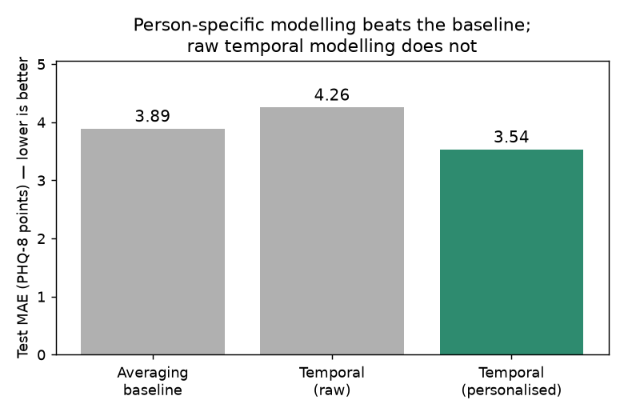
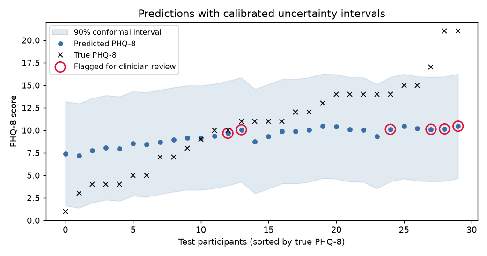
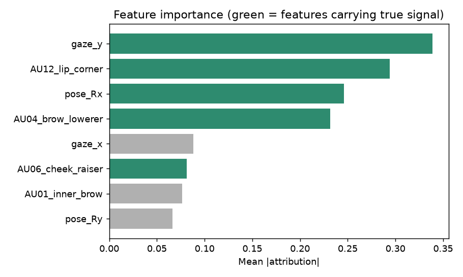

# Person-Specific, Uncertainty-Aware Depression Assessment from Expressive Behaviour

Estimating depression severity (PHQ-8) from expressive-behaviour features — facial action units, gaze, and head pose — using a **person-specific** design: each session is modelled as an individual's deviation from their own behavioural baseline, rather than against a population average.

The project pairs this idea with a trustworthy-AI layer (calibrated uncertainty, explainability, fairness) and evaluates every component honestly against controlled baselines.

> **Status:** The pipeline is built and validated on synthetic data with a known ground-truth signal, so each method can be checked where the correct answer is known. It is designed so that real clinical feature sets (of the kind used in depression-from-interview research) can be substituted with minimal change.

## Results at a glance

**Person-specific modelling is the component that helps.** The raw temporal model is *worse* than a simple averaging baseline — the gain comes from referencing each person to their own baseline, not from the neural network itself.

**Every prediction carries a calibrated uncertainty interval.** Conformal intervals reach ~87% empirical coverage (90% target); the most uncertain cases can be flagged for clinician review rather than scored automatically.

**The model explains itself sensibly.** Gradient-based attribution recovers the features where signal was actually planted (green) — gaze, a smiling action unit, head pose, and frowning — rather than latching onto a shortcut.

## Why person-specific?

Two people can show the same absolute amount of smiling, yet one is naturally reserved and the other is depressed but still fairly expressive. Referencing each session to the person's own neutral calibration segment exposes how much they *change* during interaction, rather than how expressive they are by temperament. This is a lightweight, honest operationalisation of the person-specific cognition idea in automatic affect analysis (Song et al., 2022; Zhu et al., 2024).

## Results table (synthetic data, 30-participant test set)

| Model | Test MAE (PHQ-8) | Depression accuracy |
|---|---|---|
| Averaging baseline (Ridge on session means) | 3.89 | 53% |
| Temporal GRU — raw sequences | 4.26 | 37% |
| **Temporal GRU — personalised** | **3.54** | **70%** |

### Trustworthy-AI layer — reported honestly

- **Conformal prediction (works):** 90%-target intervals achieve ~87% empirical coverage. Intervals are wide (~11 PHQ-8 points), reflecting the genuine difficulty of exact-score prediction from short sequences.
- **MC-dropout abstention (honest null):** flagging the most-uncertain cases did **not** improve accuracy on this synthetic data — dropout variance did not track error here. On real data, where per-person difficulty genuinely varies, this remains an open question. Reported rather than hidden.
- **Explainability:** attribution recovers the true signal features, confirming the model learned real structure rather than a shortcut.
- **Fairness:** performance is sliced by gender with per-group sample sizes. No bias was engineered into the synthetic data, and the observed ~1-point MAE gap is within small-sample noise — demonstrating why per-group reporting matters before any clinical claim.

## Reproduce
python -m src.synthetic_data # generate synthetic dataset
python -m src.evaluate # run everything, print the summary table
python -m assets.make_figures # regenerate the figures above

Individual components:
python -m src.inspect_data # sanity-check the planted signal
python -m src.baseline # averaging baseline
python -m src.model --mode raw # temporal, raw
python -m src.model --mode personalised # temporal, person-specific
python -m src.uncertainty # conformal + MC-dropout
python -m src.explain # feature attribution
python -m src.fairness # per-gender metrics

## Design notes

- Synthetic data mimics OpenFace-style outputs (action units, gaze, head pose) so real feature files can be swapped in with minimal change.
- All splits are by participant and seeded for reproducibility.
- Clinical data is never committed; `.gitignore` excludes `data/` and `results/` (figures live in `assets/`, which is committed).
- Small test sizes (~30) mean numbers are indicative, not conclusive — an explicit limitation.

## Planned next steps

- Evaluate on a real clinical dataset of expressive-behaviour features with depression labels.
- Repeated runs across seeds/splits for confidence intervals on the metrics.
- Add audio features (e.g. COVAREP) as a second modality.
- Revisit uncertainty–error correlation on real data, where difficulty varies across people.

## References

Gratch, J., Artstein, R., Lucas, G., Stratou, G., Scherer, S., Nazarian, A., Wood, R., Boberg, J., DeVault, D., Marsella, S. and Traum, D. (2014) 'The distress analysis interview corpus of human and computer interviews', in *Proceedings of LREC*. Reykjavik: ELRA, pp. 3123–3128.

Ringeval, F. et al. (2019) 'AVEC 2019 workshop and challenge: state-of-mind, detecting depression with AI, and cross-cultural affect recognition', in *Proceedings of the 9th International Audio/Visual Emotion Challenge and Workshop*. New York: ACM, pp. 3–12.

Song, S., Shao, Z., Jaiswal, S., Shen, L., Valstar, M. and Gunes, H. (2022) 'Learning person-specific cognition from facial reactions for automatic personality recognition', *IEEE Transactions on Affective Computing*, 14(4), pp. 3048–3065.

Zhu, H., Kong, X., Xie, W., Huang, X., Shen, L., Liu, L., Gunes, H. and Song, S. (2024) 'PerFRDiff: personalised weight editing for multiple appropriate facial reaction generation', in *Proceedings of the 32nd ACM International Conference on Multimedia*. New York: ACM, pp. 9495–9504.
